## AUTOMATE INFRASTRUCTURE WITH IAC USING TERRAFORM PART 1
---

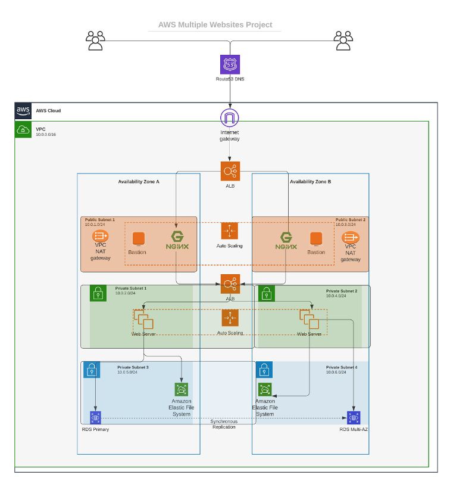
- It is time to automate the process using Terraform.
Let us start building the same set up with the power of Infrastructure as Code (IaC)

- Prerequisites before you begin writing Terraform code

   * Create an IAM user, name it terraform (ensure that the user has only programatic access to your AWS account) and grant this user AdministratorAccess permissions.
   * Copy the secret access key and access key ID. Save them in a notepad temporarily.
   * Configure programmatic access from your workstation to connect to AWS using the access keys copied above and a Python SDK (boto3). You must have Python 3.6 or higher on your workstation.
   * If you are on Windows, use gitbash, if you are on a Mac, you can simply open a terminal. Read here to configure the Python SDK properly.

   * For easier authentication configuration – use AWS CLI with aws configure command.

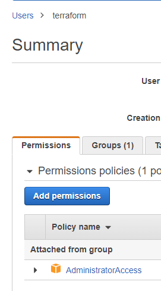

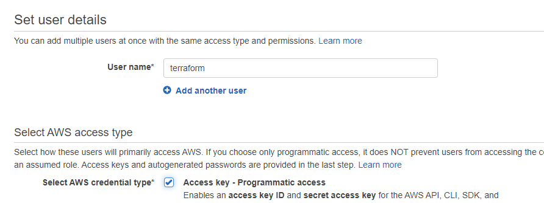
1. Create an S3 bucket to store Terraform state file. You can name it something like `babalola-dev-terraform-bucket` (Note: S3 bucket names must be unique unique within a region partition, you can read about S3 bucken naming in this article). We will use this bucket from Project-17 onwards.

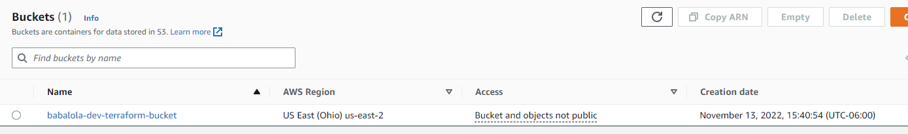


2. When you have configured authentication

You shall see your previously created S3 bucket name – `babalola-dev-terraform-bucket`

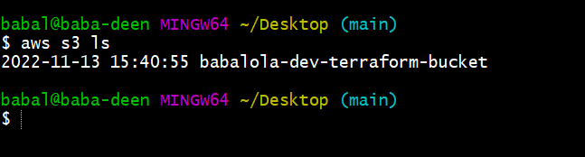


### The secrets of writing quality Terraform code

- The secret recipe of a successful Terraform projects consists of:

   * Your understanding of your goal (desired AWS infrastructure end state)
   * Your knowledge of the IaC technology used (in this case – Terraform)
   * Your ability to effectively use up to date Terraform documentation here

- As you go along completing this project, you will get familiar with Terraform-specific terminology, such as:

  * Attribute
  * Resource
  * Interpolations
  * Argument
  * Providers
  * Provisioners
  * Input Variables
  * Output Variables
  * Module
  * Data Source
  * Local Values
  * Backend

- Make sure you understand them and know when to use each of them.

- Another concept you must know is ` data type.`  This is a general programing concept, it refers to how data represented in a programming language and defines how a compiler or interpreter can use the data. Common data types are:

  * Integer
  * Float
  * String
  * Boolean, etc.

### Best practices
  * Ensure that every resource is tagged using multiple key-value pairs. You will see this in action as we go along.
  * Try to write reusable code, avoid hard coding values wherever possible. (For learning purpose, we will start by hard coding, but gradually refactor our work to follow best practices).


  ## VPC | SUBNETS | SECURITY GROUPS

* Let us create a directory structure
* Open your Visual Studio Code and:

  * Create a folder called PBL
  * Create a file in the folder, name it main.tf

* Your setup should look like the below.

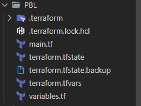


### FIXING THE PROBLEMS BY CODE REFACTORING
---
* Fixing Hard Coded Values: We will introduce variables, and remove hard coding.

- see below updated code

``` 
# Get list of availability zones
data "aws_availability_zones" "available" {
  state = "available"
}

variable "region" {
  default = "us-east-2"
}

variable "vpc_cidr" {
  default = "172.16.0.0/16"
}

variable "enable_dns_support" {
  default = "true"
}

variable "enable_dns_hostnames" {
  default = "true"
}

variable "enable_classiclink" {
  default = "false"
}

variable "enable_classiclink_dns_support" {
  default = "false"
}

variable "preferred_number_of_public_subnets" {
  default = 2
}

provider "aws" {
  region = var.region
}

# Create VPC
resource "aws_vpc" "main" {
  cidr_block                     = var.vpc_cidr
  enable_dns_support             = var.enable_dns_support
  enable_dns_hostnames           = var.enable_dns_support
  enable_classiclink             = var.enable_classiclink
  enable_classiclink_dns_support = var.enable_classiclink

}

# Create public subnets
resource "aws_subnet" "public" {
  count                   = var.preferred_number_of_public_subnets == null ? length(data.aws_availability_zones.available.names) : var.preferred_number_of_public_subnets
  vpc_id                  = aws_vpc.main.id
  cidr_block              = cidrsubnet(var.vpc_cidr, 4, count.index)
  map_public_ip_on_launch = true
  availability_zone       = data.aws_availability_zones.available.names[count.index]

}
```

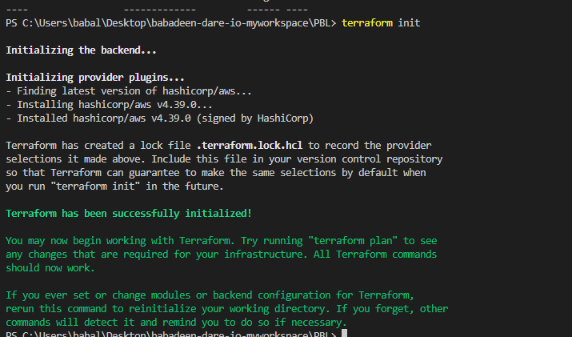

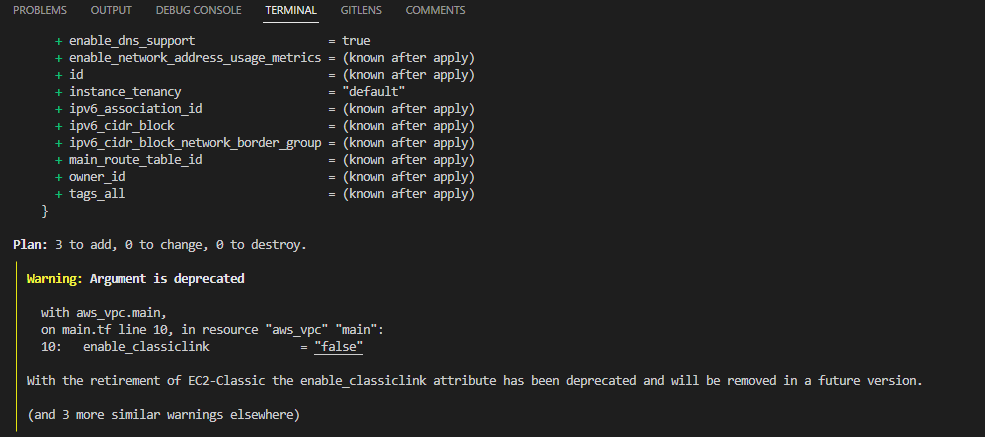

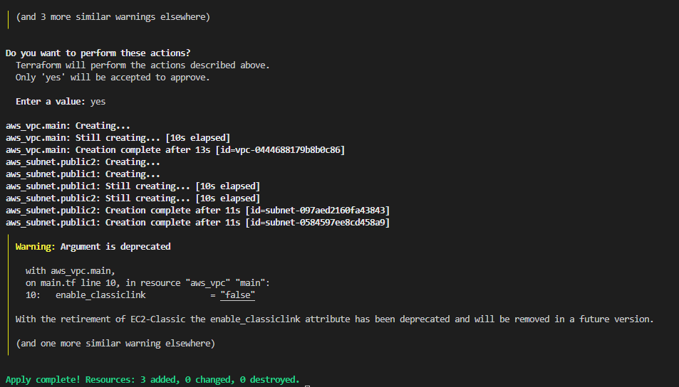

### Introducing variables.tf & terraform.tfvars
---
* Instead of havng a long lisf of variables in main.tf file, we can actually make our code a lot more readable and better structured by moving out some parts of the configuration content to other files.

  * We will put all variable declarations in a separate file
  * And provide non default values to each of them
1. Create a new file and name it variables.tf
2. Copy all the variable declarations into the new file.
3. Create another file, name it terraform.tfvars
4. Set values for each of the variables.


* see below code for Main.tf 

```
# Get list of availability zones
data "aws_availability_zones" "available" {
  state = "available"
}

provider "aws" {
  region = var.region
}

# Create VPC
resource "aws_vpc" "main" {
  cidr_block                     = var.vpc_cidr
  enable_dns_support             = var.enable_dns_support
  enable_dns_hostnames           = var.enable_dns_support
  enable_classiclink             = var.enable_classiclink
  enable_classiclink_dns_support = var.enable_classiclink

}
# Create public subnets
resource "aws_subnet" "public" {
  count                   = var.preferred_number_of_public_subnets == null ? length(data.aws_availability_zones.available.names) : var.preferred_number_of_public_subnets
  vpc_id                  = aws_vpc.main.id
  cidr_block              = cidrsubnet(var.vpc_cidr, 4, count.index)
  map_public_ip_on_launch = true
  availability_zone       = data.aws_availability_zones.available.names[count.index]
}
```

* see below code for variables.tf 

``` 
variable "region" {
  default = "us-east-2"
}

variable "vpc_cidr" {
  default = "172.16.0.0/16"
}

variable "enable_dns_support" {
  default = "true"
}

variable "enable_dns_hostnames" {
  default = "true"
}

variable "enable_classiclink" {
  default = "false"
}

variable "enable_classiclink_dns_support" {
  default = "false"
}

variable "preferred_number_of_public_subnets" {
  default = null
}
```

* see below code for terraform.tfvars
```
region = "eu-central-1"

vpc_cidr = "172.16.0.0/16"

enable_dns_support = "true"

enable_dns_hostnames = "true"

enable_classiclink = "false"

enable_classiclink_dns_support = "false"

preferred_number_of_public_subnets = 2
```


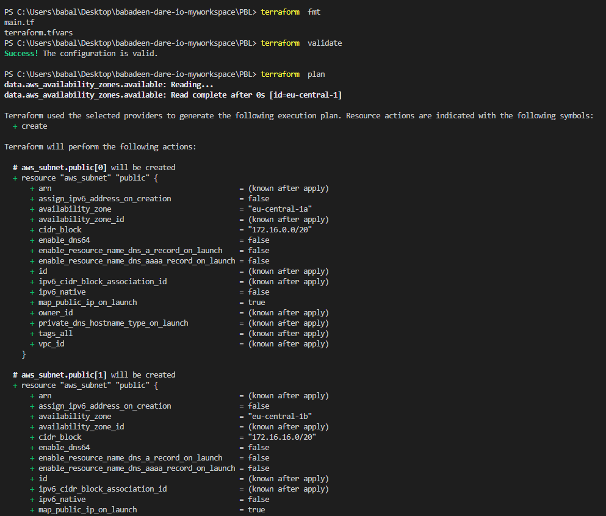
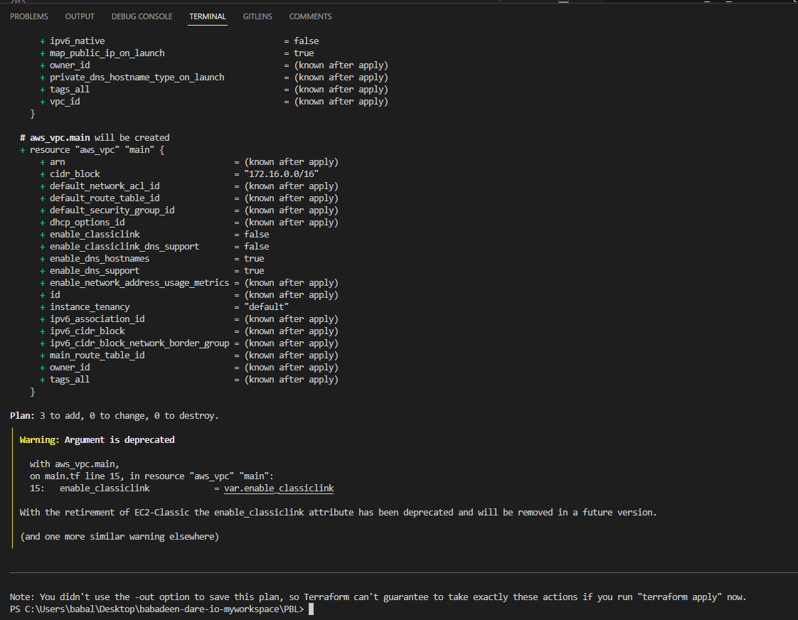
